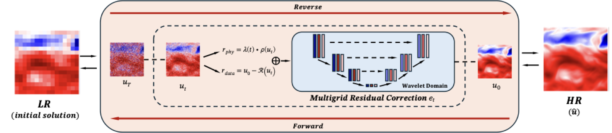
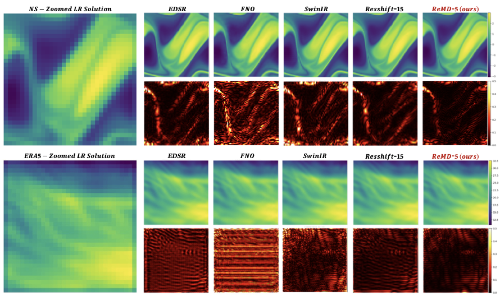
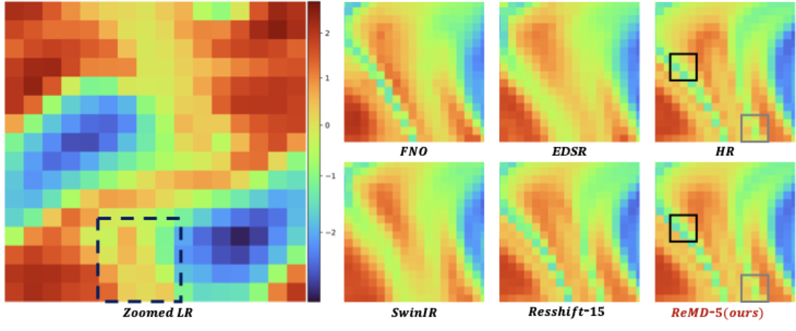

# ReMD

[](#citation)
[](https://github.com/lizhihao2022/ReMD)
[](https://www.python.org/)
[](https://pytorch.org/)
[](LICENSE)

Official PyTorch implementation of the CVPR 2026 paper:

**Physics-Consistent Diffusion for Efficient Fluid Super-Resolution via Multiscale Residual Correction**

ReMD (**Re**sidual-**M**ultigrid **D**iffusion) is a physics-consistent diffusion framework for fluid super-resolution. Instead of treating super-resolution as generic image restoration, ReMD performs residual correction inside the reverse diffusion trajectory, combining coarse-scale consistency, multigrid refinement, and lightweight physics cues.

## News

- The paper is published at CVPR 2026.
- This repository contains the official code implementation of ReMD.

## Method Overview



At each reverse step, ReMD starts from a coarse LR-conditioned state and constructs a residual direction from two complementary sources:

- **Data consistency:** the current HR estimate is restricted back to the coarse space and compared with the LR anchor.
- **Physics-consistent cues:** differentiable residuals encourage smoothness, edge-preserving diffusion, and spectral alignment without requiring explicit PDE supervision.
- **Time-gated multigrid correction:** the residual is corrected across a fixed multiwavelet hierarchy, removing large-scale bias early and refining fronts or vortices later.
- **Few-step sampling:** the coarse-to-fine correction keeps the reverse path close to a physically plausible manifold, enabling high-quality outputs with only 2-5 reverse steps.

## Results at a Glance

ReMD is evaluated on Navier-Stokes, ERA5, and Ocean benchmarks. It improves RMSE and spectral fidelity while using far fewer reverse steps than diffusion baselines.

| Dataset | Scale | Variant | RMSE ↓ | PSNR ↑ | SSIM ↑ | Steps |
| --- | ---: | --- | ---: | ---: | ---: | ---: |
| NS | 2x | ReMD-5 | **2.09E-02** | **49.94** | **0.998** | 5 |
| ERA5 | 4x | ReMD-5 | **8.02E-02** | **58.19** | **0.999** | 5 |
| Ocean | 4x | ReMD-2 | **1.32E-02** | **47.72** | **0.983** | 2 |

Compared with ResShift-15 on NS, ReMD-5 achieves better RMSE/PSNR with fewer steps and lower inference time; ReMD-2 remains competitive while being faster.

## Qualitative Comparison



On NS and ERA5, ReMD-5 reconstructs sharper coherent fronts and cleaner small-scale structures. The error maps show lower artifacts than image-SR and operator-learning baselines, and lower errors than ResShift despite using 5 instead of 15 reverse steps.



The patch-level NS comparison highlights two behaviors: ReMD preserves cross-front gradients without staircasing or checkerboard artifacts, and it recovers compact small eddies while remaining consistent with the LR content.

## Installation

Create an environment and install dependencies:

```bash
pip install -r requirements.txt
```

The code is implemented with PyTorch. CUDA is recommended for training and inference.

## Datasets

The repository includes data loaders for:

- Navier-Stokes data in `.mat` or HDF5 format
- ERA5 data in `.npy` format
- Ocean velocity data in HDF5 format

Before training, update `data.data_path` in the config file:

```yaml
data:
  data_path: "./data/NavierStokes_V1e-5_N1200_T20.mat"
```

## Training

Single-process training:

```bash
python main.py --config template_configs/ns2d/remd.yaml
```

Distributed training:

```bash
torchrun --nproc_per_node=4 main_ddp.py --config template_configs/ns2d/remd_ddp.yaml
```

The default configs are templates. Adjust dataset paths, batch sizes, number of GPUs, and logging paths for your environment.

## Repository Structure

```text
datasets/                 Dataset loading and preprocessing
models/remd/              ReMD model, diffusion process, residual correction, and physics cues
template_configs/ns2d/    Training configs
trainers/                 ReMD training loop
utils/                    Losses, metrics, normalization, and helper utilities
main.py                   Single-process training entry point
main_ddp.py               Distributed training entry point
assets/                   README figures
```

## Citation

If you find this repository useful, please cite:

```bibtex
@inproceedings{li2026remd,
  title     = {Physics-Consistent Diffusion for Efficient Fluid Super-Resolution via Multiscale Residual Correction},
  author    = {Li, Zhihao and Dong, Shengwei and Yi, Chuang and Gao, Junxuan and Lai, Zhilu and Liu, Zhiqiang and Wang, Wei and Zhang, Guangtao},
  booktitle = {Proceedings of the IEEE/CVF Conference on Computer Vision and Pattern Recognition},
  year      = {2026}
}
```

## License

This project is released under the MIT License. See [LICENSE](LICENSE) for details.
